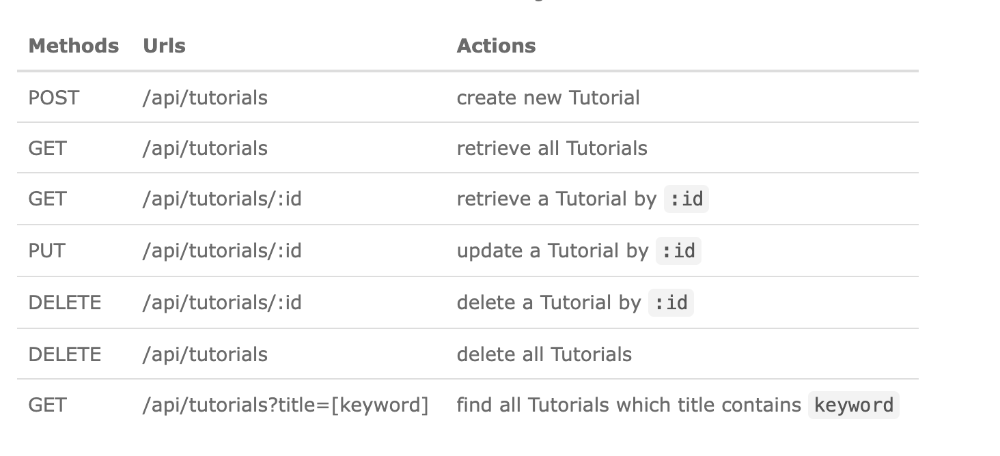
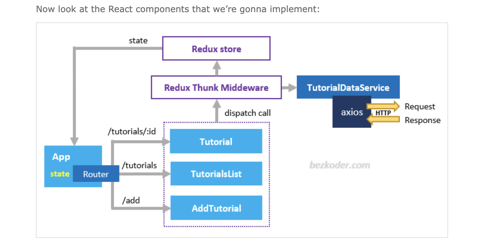
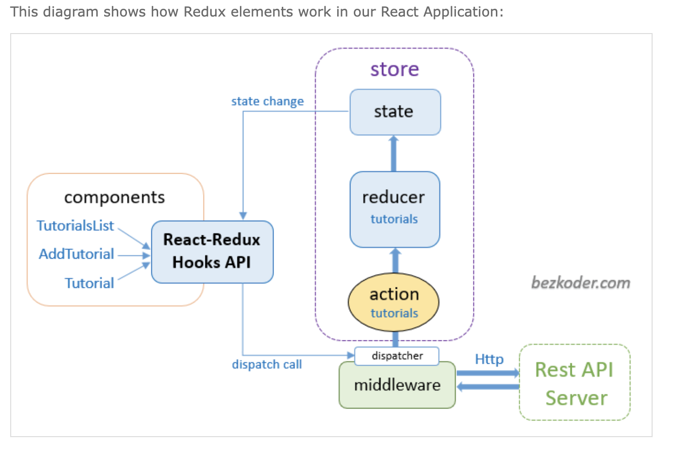

# Redux-Toolkit CRUD example with React Hooks

In this tutorial, I will show you how to build a Redux Toolkit CRUD example using React Hooks working with Rest API, display and modify data with Router, Axios & Bootstrap..
# Overview of Redux Toolkit CRUD example

We will build a React Redux Tutorial Application with Rest API calls in that:

Each Tutorial has id, title, description, published status.
We can create, retrieve, update, delete Tutorials.
There is a Search bar for finding Tutorials by title.
Here are screenshots of our React Redux CRUD Application.

### `– Create a Tutorial:`

### `– Retrieve all items`

### `– Click on Edit button to update an item:`

### `- On this Page, you can:`

**Note: this is a one-way operation. Once you `eject`, you can't go back!**

. change status to Published using Publish button
. delete the item using Delete button
. update the item details with Update button

### `– Search Tutorials by title:`

### `– Check Redux State with Dev-tool:`

### `– This React Redux-Toolkit Client consumes the following Web API:`

### `– Redux-Toolkit CRUD with React Hooks Component Diagram`

### `– Redux-Toolkit CRUD with Hooks and Rest API example`

### `– Technology`

. React 18
. react-redux 8
. redux-toolkit 1.8.5
. react-router-dom 6
. axios 1.1.3
. bootstrap 5.2.2
